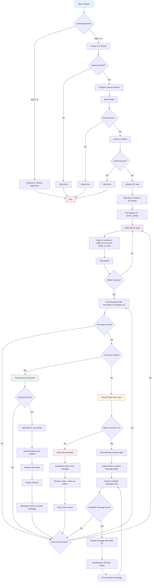

```mermaid
flowchart TD
    A["Start Program"] --> B{"Check Arguments"}
    B -- "argc != 2" --> C["Fatal Error: Wrong arguments"]
    B -- "argc == 2" --> D["Create TCP Socket"]
    D --> E{"Socket Created?"}
    E -- No --> F["Fatal Error"]
    E -- Yes --> G["Configure Server Address"]
    G --> H["Bind Socket"]
    H --> I{"Bind Success?"}
    I -- No --> J["Fatal Error"]
    I -- Yes --> K["Listen on Socket"]
    K --> L{"Listen Success?"}
    L -- No --> M["Fatal Error"]
    L -- Yes --> N["Initialize FD Sets"]
    N --> O["Add Server Socket to all_sockets"]
    O --> P["Set highest_fd = server_socket"]
    P --> Q["Main Server Loop"]
    Q --> R["Copy all_sockets to ready_to_read and ready_to_write"]
    R --> S["Call select()"]
    S --> T{"Select Success?"}
    T -- No --> Q
    T -- Yes --> U["Loop through all file descriptors 0 to highest_fd"]
    U --> V{"FD ready to read?"}
    V -- No --> W{"More FDs to check?"}
    V -- Yes --> X{"Is it server socket?"}
    X -- Yes --> Y["Accept New Connection"]
    Y --> Z{"Accept Success?"}
    Z -- No --> W
    Z -- Yes --> AA["Add client to all_sockets"]
    AA --> BB["Update highest_fd if needed"]
    BB --> CC["Initialize client data"]
    CC --> DD["Assign client ID"]
    DD --> EE@{ label: "Broadcast 'client X arrived' message" }
    EE --> W
    X -- No --> FF["Receive data from client"]
    FF --> GG{"Bytes received > 0?"}
    GG -- No --> HH["Client Disconnected"]
    HH --> II@{ label: "Broadcast 'client X left' message" }
    II --> JJ["Remove client - clean up buffers"]
    JJ --> KK["Close client socket"]
    KK --> W
    GG -- Yes --> LL["Null terminate received data"]
    LL --> MM@{ label: "Append data to client's message buffer" }
    MM --> NN["Extract complete messages loop"]
    NN --> OO{"Complete message found?"}
    OO -- No --> W
    OO -- Yes --> PP["Format message with client ID"]
    PP --> QQ["Broadcast to all other clients"]
    QQ --> RR["Free complete message"]
    RR --> NN
    W -- Yes --> U
    W -- No --> Q
    C --> SS["Exit"]
    F --> SS
    J --> SS
    M --> SS
    EE@{ shape: rect}
    II@{ shape: rect}
    MM@{ shape: rect}
    style A fill:#e1f5fe
    style Q fill:#f3e5f5
    style Y fill:#e8f5e8
    style FF fill:#fff3e0
    style HH fill:#ffebee
    style SS fill:#fce4ec
```